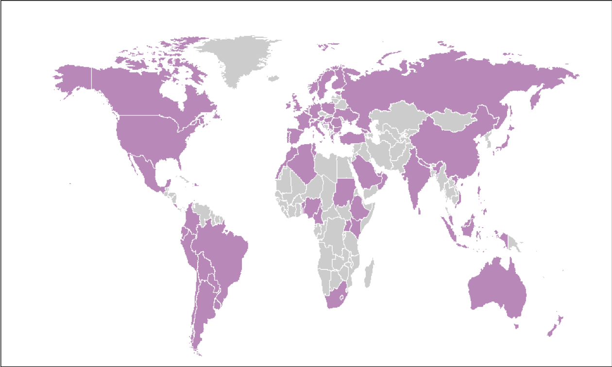
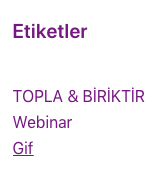
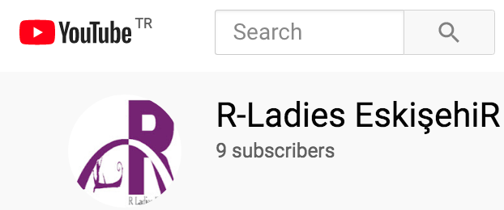

```{r xaringan-themer, include=FALSE, warning=FALSE}
library(xaringanthemer)
style_duo_accent(primary_color = "#c79ad7", secondary_color = "#F5F9F8",background_color = "#D3C4D2",text_color = "#47245F", text_slide_number_color = "white",header_color = "white",title_slide_text_color = "white",base_font_size = "26px")

```

<style type="text/css">
div.ui-menu li {
    list-style:none;
    background-image:none;
    background-repeat:none;
    background-position:0; 
}
ul
{
    list-style-type:none;
    padding:0px;
    margin:0px;
}
li
{
    background-image:url(sqpurple.gif);
    background-repeat:no-repeat;
    background-position:0px 5px; 
    padding-left:14px;
}

.title-slide {
    background-image: url(tree.png);
    background-position: 90% 40%;
    background-size: 100%;
    color: #fff;
    opacity: 0.5;
}

@import url('https://fonts.googleapis.com/css?family=Bitter&display=swap');
.remark-slide-content{ background-color: #47245F;
                       color: #fff; /* Regular text */
                       font-family: 'Bitter', serif;
}

h2, h3 {text-align: center;}
</style>


<h1 style="color:#c79ad7;"> R-Ladies Eskişehir ve Hedefleri </h1>


<div class="ui-menu">
<ul list-style:none;>

   <li> &#127815; R-Ladies Eskişehir, R programı kullanan kadınların kurduğu dünya çapında bir organizasyon olan R Global ailesinin bir parçasıdır.</li> 

<br> 
  <li>&#127815; R kullanan ve geliştiren kadınlarla bir iletişim ortamı sağlamak</li> </br>


  <li> &#127815;  Kadınları R kodları yazmaya, paket geliştirmeye ve R konferanslarına konuşmacı olarak katılmaya teşvik etmek</li> 
</ul>
</div>

---

<h1 style="color:#c79ad7;"> R-Ladies Global </h1>

```{r, echo=FALSE,out.width="90%", fig.align='center'}

```

---

<h4 style="color:#c79ad7;"> R-Ladies Global </h4>

<svg width="200" height="150">
   <circle cx="110" cy="60" r="50" stroke="#583f61" stroke-width="4" fill="white" />
   <text fill="#59206e" font-size="18" font-family="Verdana"
     x="75" y="60">86 ÜLKE </text>
 </svg>
 
 <svg width="250" height="150">
   <circle cx="180" cy="60" r="50" stroke="#583f61" stroke-width="4" fill="white" />
    <text fill="#59206e" font-size="16" font-family="Verdana"
     x="135" y="60">407 ŞEHİR </text>
 </svg>
 
  <svg width="280" height="150">
   <circle cx="220" cy="60" r="50" stroke="#583f61" stroke-width="4" fill="white" />
   <text fill="#59206e" font-size="15" font-family="Verdana"
     x="175" y="60">762715 ÜYE </text>
 </svg>
 
--

<h4 style="color:#c79ad7;"> R-Ladies Türkiye </h4>
--

```{r, echo=FALSE,out.width="80%", fig.align='center'}
knitr::include_graphics('slide5.png')
```
 
---
<h3 style="color:"#6D2E85; text-align="center"> BİZ KİMİZ? </h3>

--
<h3 style="color:"#6D2E85;> www.rladieseskisehir.org </h3>

--
```{r, echo=FALSE,out.width="23%", fig.align='right'}

```
--
```{r, echo=FALSE,out.width="20%", fig.align='center'}

```
--
```{r, echo=FALSE,out.width="10%", fig.align='left'}

```
--

```{r, echo=FALSE,out.width="20%", fig.align='center'}

```
--

```{r, echo=FALSE,out.width="16%", fig.align='right'}

```

--

```{r, echo=FALSE,out.width="17%", fig.align='left'}

```

---
<h3 style="color:"#6D2E85; text-align="center"> İLETİŞİM </h3>
--

```{r, echo=FALSE,out.width="40%", fig.align='left'}

```
--

```{r, echo=FALSE,out.width="42%", fig.align='center'}

```
--

```{r, echo=FALSE,out.width="38%", fig.align='right'}

```
---


<h3 style="color:"#6D2E85;> TEŞEKKÜRLER </h3>


Slaytlar için R paketi özel html/css kodları, [xaringan](https://bookdown.org/yihui/rmarkdown//xaringan.html) ile  [**knitr**](http://yihui.name/knitr) ve [R Markdown](https://rmarkdown.rstudio.com) kullanılmıştır.

 Kodları GitHub üzerinden incelemek için: [bkanx](https://github.com/bkanx) hesabını ziyaret ediniz.

---


```{r, echo=FALSE,out.width="100%",fig.align='center'}
knitr::include_graphics('slide8.png')
```
